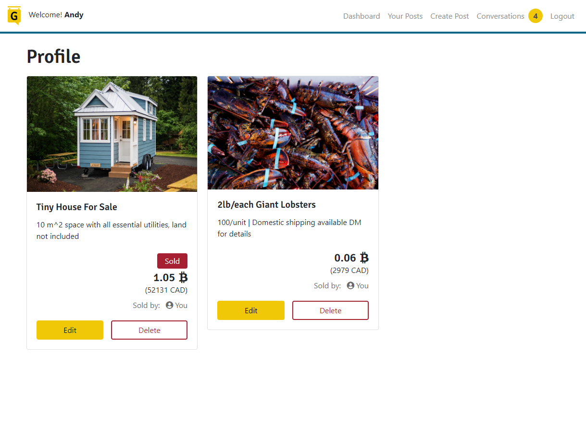
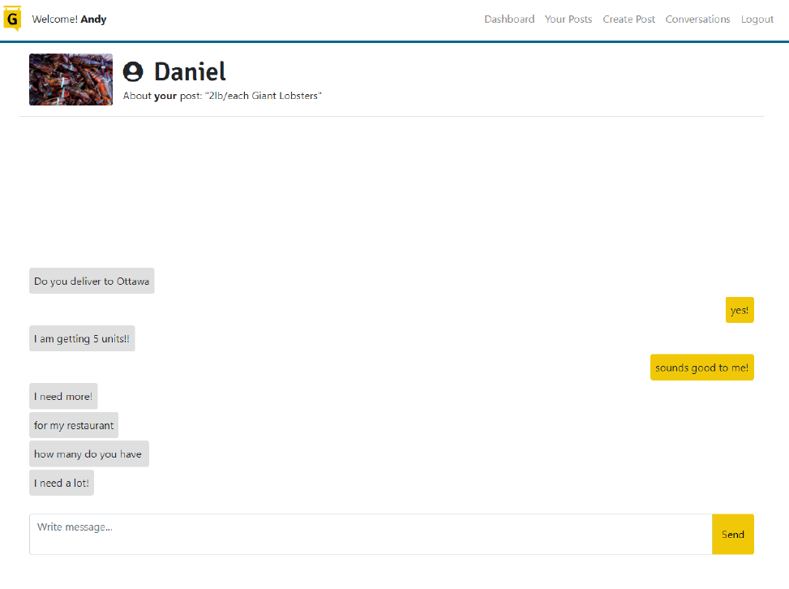

# BitGora


BitGora is your marketplace to buy and sell goods using Bitcoin. Your dashboard will display other users' postings and your posts will be available to other users. If you see a post that you're interested in, BitGora comes with a chat function to arrange meet-ups or negotiate price.

## Purpose

Bitcoin is a popular cryptocurrency, but we noticed a gap in being able to spend or gain Bitcoin without having to trade it. We wanted to extend the usage of Bitcoin and fill this gap with BitGora. BitGora provides an easier opportunity at gaining Bitcoin with smaller and more familiar transactions of buying/selling goods.

Because of BitGora's chat functions, BitGora also builds a community and connects Bitcoin enthusiats together.





## Starting the app locally

Start by installing front and backend dependencies. While in this directory, run the following command:

```
npm install
```

This should install node modules within the server and the client folder.

After both installations complete, run the following command in your terminal:

```
npm start
```

Your app should now be running on <http://localhost:3000>.

## Built with:

### Front-End

- [React](https://reactjs.org/)
- [React-Bootstrap](https://react-bootstrap.github.io/)
- [Coindesk API](https://www.coindesk.com/coindesk-api)
- [Socket.io (Client)](https://socket.io/)

### Back-End

- [Express](https://expressjs.com/)
- [Mongoose](https://mongoosejs.com/)
- [Passport](http://www.passportjs.org/)
- [Cloudinary](https://cloudinary.com/)
- [Socket.io (Server)](https://socket.io/)

## License

BitGora is protected under the [**MIT License**](./LICENSE).
